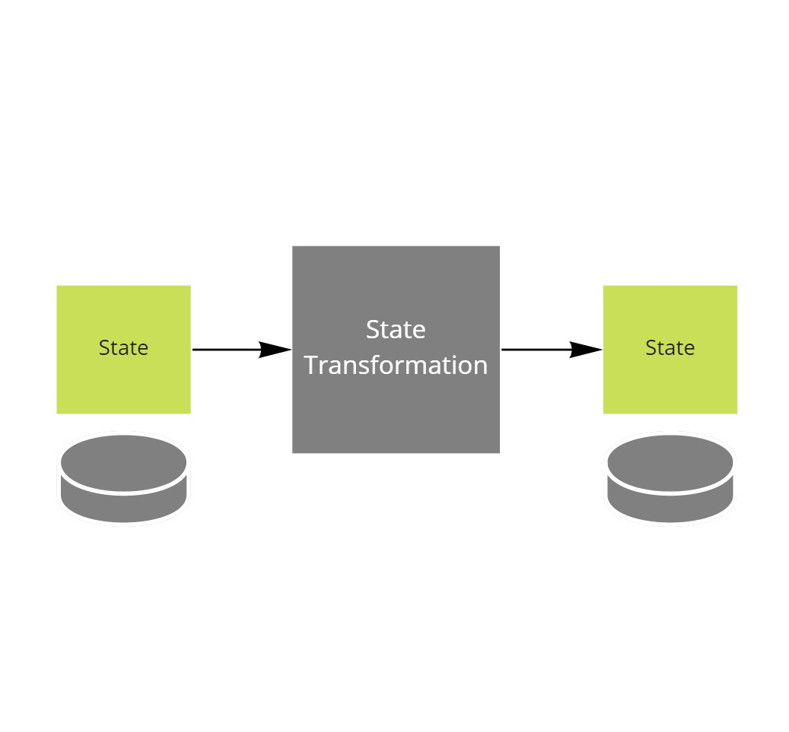

# Implementing state transformation

This project is part of the [MessageHandler processing patterns](https://www.messagehandler.net/patterns/) library.

MessageHandler is distributed under a commercial license, for more information on the terms and conditions refer to [our license page](https://www.messagehandler.net/license/).

## What is state transformation

State transformation converts state data into a different format.

## When to use it

Use this pattern to show, or store, data in a different format.

## What you need to get started

- The [.NET 6 SDK](https://dotnet.microsoft.com/en-us/download) should be installed
- The sample was created using [Visual Studio 2022 community edition](https://visualstudio.microsoft.com/vs/).

## Running the sample

You can just start the API, no further configuration is required.

The booking id to provide to invoke the transformation is `1aa6ab11-a111-4687-a6e0-cbcf403bc6a8`;

## How to implement it yourself

MessageHandler is not used in this implementation.